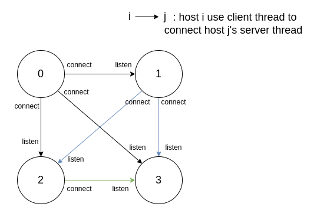

RDMA-MESH
=============================================================================
**rdma-mesh** is a simple rdma communication test program for [jiajia](https://github.com/Youpen-y/jiajia)(SDSM).

It uses multi-threads to establish _RDMA RC_ full connection ( _any two hosts in a cluster have a connection_ ) and communication with message between multiple hosts.

Dependency
-----------------------------------------------------------------------------
* librdmacm
* libibverbs

Structure
-----------------------------------------------------------------------------


- client thread: `run_client()` in rdma-mesh/rdma_mesh.c, used to prepare the connection resources and listen the connect request.
- server thread: `run_server()` in rdma-mesh/rdma_mesh.c, used to prepare the connection resources and initiate the connect request.

After the connection established, `cm_id_array[i]` (struct rdma_cm_id) in every host(!i) was used to communicate with host i.

Beside the threads that used to establish the connection, there are other threads used to construct a simple communication model.
- `rdma_client_thread`: post send wr continuously.

- `rdma_listen_thread`: post recv wr continuously.

- `rdma_server_thread`: wait new msg and serve.


Usage
-----------------------------------------------------------------------------
As an example program, rdma-mesh only support two hosts. ( Complete version can be found in [jiatest](https://github.com/segzix/jiatest) and [jiajia](https://github.com/Youpen-y/jiajia).)

`ip_array` in main.c is the ip array of hosts in a cluster, which need to reconfigure according to the cluster's setting.

- clone
```bash
git clone git@github.com:Youpen-y/rdma-mesh.git
```
- build
```bash
make
```
- execute
```bash
./mesh <host_id> <total_hosts>
```
- clean
```bash
make clean
```